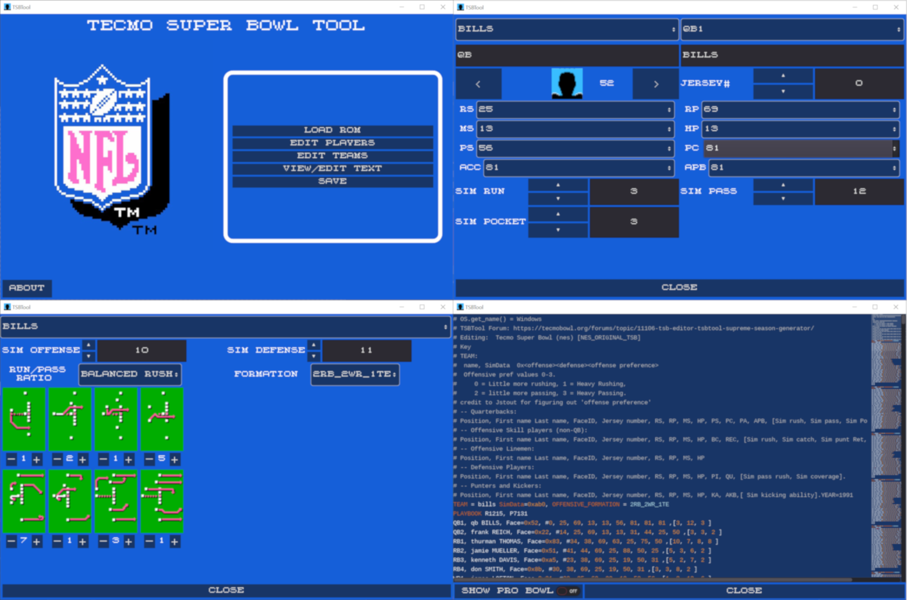

# Godot 3 C# + HTML5 Project

[Godot 3 TSBTool HTML5 Export](https://bad-al.github.io/tsbtools/TSBTool_Godot_3/TSBTool_Godot3.html)

<a href="./app_images/Overview.png">
    
</a>


Note: If building this project, you'll want to have 
 * Visual Studio 2022
 * Godot 3.5.3 

And you'll need to run the ```Lib.NET\create_links.bat``` file (to reference the core TSBTool code).

A few issues I encountered:
### Issue 1
The HTML5 mono export seemed to have trouble with GDScript -> C# communication using the following pattern:
```python
    # Not so successful when running in the browser
    var csharp_script = load("res://path/to/MyCSharpClass.cs")
    var instance = csharp_script.new()
```

So I switched the approach where I create a simple scene (TecmoControl.tscn [Label]) with an attached C# Script and add it to my main UI (in my case, the main UI was implemented in GDScript). This Node with attached C# script becomes the conduit over to the C# side.

### Issue 2
**File access**

Godot wasn't able to browse any useful files int the browser's Sandbox. So a work around is to Get the browser to prompt the user for loading/saving files.
For this to work I ended up injecting some JavaScript into the main broswer window (main_panel.gd; insert_html_and_js(), handle_html5_file_prompting()).

### Issue 3 
**JavaScript -> GDScript communication**

This wasn't so bad to get to work. The documentation examples are pretty good, I just need to squint my eyes a little before I understood the pattern:
```python
var myCallback:JavaScriptObject

func _ready():
	disable_buttons()
	# tecmoControl has a C# script attached and becomes the conduit over to the c# side
	var  tecmoControl = $MarginContainer/VBoxContainer/bottomPanel/tecmoControl 
	print("main_panel._ready() C# message:" + tecmoControl.TecmoHelper.GetMessageFromCSharp())
	Globals.tecmoHelper = tecmoControl.TecmoHelper
	
	if OS.get_name() == "HTML5":
		myCallback = JavaScript.create_callback(self, "fileLoaded")
		var window = JavaScript.get_interface("window")
		window.fileLoaded = myCallback
		insert_html_and_js()
```

### Issue 4
**JavaScript -> GDScript type conversion.**

I tried for a couple hours to get the file contents for the selected file back over to the GDScript side as something akin to a byte array.
Tried passing back the 'Uint8Array' created on the JavaScript side over to the GDScript side but it came over as a JavaScriptObject and it wasn't clear how to make it into something useful that GDScript could understand as a byte array.

But Strings work just fine as a means to transfer data back and forth; so I ended up Base64 encoding the binary data to transfer it over (C# can decode that pretty easy, I believe GDScript/Godot has built-in Base64 encode/decode too [Marshalls class]).


### Iasue 5
**Getting a browser to run the thing.**

The exported html is intended to be 'web served', but I was able to get it loading and working in Firefox without the server
(Can't remember what settings I needed to set for that though).
Otherwise the 'HTML5' button (next to the debug stop button) in the Godot 3.5.3 Editor is a good option. 
NOTE: You do need to remember to clear browser cache or configure it not to cache.

## 1st project Impressions
* I was surprised just how rich Godot 3's UI development solution was, Godot 4.3 is even better. It's not as easy as Windows.Forms in Visual Studio, but Godot's UI controls offer easier customization for the most part (the syntax highlighting, document map of the TextEdit was soooo enjoyable to find).

* The Browser based program does seem slower than the Windows exe.
* Output size for Windows export = 74MB
* Output size for HTML5 export = 43.8MB

* After 'completing' this project I think I would prefer sticking to GDScript as much as possible in Godot and only use C# if there's some really good C# code that is really key to the operation (in the case of this project, I ended up re-using all of the 'core' code and a lot of the UI code from TSBTool's Windows exe program). 
* Writing GDScript code in the Godot IDE is really nice, especially with the ease of access to the built-in documentation. Allowing the user to switch over to Visual Studio to operate on the C# code is the right way to go. But I do feel like the C# side slowed down my development progress even though I love C# and have been using it for years; GDScript+ Godot editor just is such a great language to code in.

## Performance findings
I ended up using a couple simple algorithms for performance testing (isPrime and fibonacci )
Pure C# code executes A LOT faster than GDScript running on Windows and about 2-4x the speed running the browser.
But if you're running in the browser and you want to offload calculations to a faster language, looks like you're 
far better off using JavaScript than C# in the browser (for passing data, perhaps passing over args with JSON.stringify(data) [or base64 encoding binary data] would be a good way to communicate the data to be operated on).

|                       | fib(40) in seconds | generatePrime(10000000) in seconds |
| --------------------- | ---------       | -------------------------       |
| GDScript IDE Debugger | 68              | 57                              |
| GDScript Windows exe  | 50              | 58                              |
| GDScript Firefox      | 75              | 91                              |
| GDScript Edge         | 84              | 91                              |
| GDScript Brave        | 89              | 91                              |
| C# IDE Debugger       | 0.913           | 0.907                           |
| C# Windows exe        | 0.44            | 0.91                            |
| C# Firefox            | 32.061          | 50.131                          |
| C# Edge               | 22.471          | 36.085                          |
| C# Brave              | 22.398          | 36                              |
| JavaScript Firefox    | 28.04           | 22.11                           |
| JavaScript Edge       | 0.957           | 0.887                           |
| JavaScript Brave      | 0.957           | 0.882                           |

Looks Like C# w/mono in the browser just isn't very fast.
### Code for the performance tests

<details> <summary>C# Code</summary>

```cs
public string time_fib(int n) {
	Stopwatch sw = Stopwatch.StartNew();
	var result = fib(n);
	sw.Stop();
	string retVal = $"C#       fib({n}) = {result}; time: {sw.ElapsedMilliseconds/1000.0:0.######} s\n";
	return retVal;
}

public int fib(int n) {
	if (n < 3) return 1;
	return fib(n - 1) + fib(n - 2);
}

public string prime_time(int n) {
	Stopwatch sw = Stopwatch.StartNew();
	var result = generatePrimes(n);
	sw.Stop();
	string retVal = $"C#       prime_time({n}) count: {result.Count}; time: {sw.ElapsedMilliseconds / 1000.0:0.######} s\n";
	return retVal;
}

bool isPrime(int num) {
	if (num <= 1) return false;
	if (num <= 3) return true;

	if (num % 2 == 0 || num % 3 == 0) return false;

	for (int i = 5; i * i <= num; i += 6)
		if (num % i == 0 || num % (i + 2) == 0) return false;

	return true;
}

List<int> generatePrimes(int n) {
	List<int> primes = new List<int>(1000);
	for (int i = 2; i <= n; i++)
		if (isPrime(i))
			primes.Add(i);	
	return primes;
}

```

</details>

<details> <summary>GDScript Code</summary>

```py
func fib(num:int) -> int:
	if num < 3:
		return 1
	return fib(num-1) + fib(num -2)

func time_fib(n:int) -> String:
	var start_time = OS.get_ticks_msec()
	var result := fib(n)
	var end_time = OS.get_ticks_msec()
	var timeInSeconds:float = (end_time - start_time)/1000
	var msg := "GDScript fib(%d) = %d; time : %.6f s\n" % [n, result, timeInSeconds]
	return msg

func prime_time(n:int) -> String:
	var start_time = OS.get_ticks_msec()
	var result := generatePrimes(n);
	var end_time = OS.get_ticks_msec()
	var timeInSeconds:float = (end_time - start_time)/1000
	var msg := "GDScript generatePrimes(%d) count %d; time : %.6f s\n" % [n, result.size(), timeInSeconds]
	return msg

func generatePrimes(n:int) -> Array:
	var primes = []
	var i := 2
	while i <= n:
		if isPrime(i) :
			primes.push_back(i)
		i += 1 
	return primes

func isPrime( num:int) -> bool:
	if (num <= 1):
		return false
	if (num <= 3):
		return true
	if (num % 2 == 0 || num % 3 == 0):
		return false
	var i := 5
	while ( i * i <= num):
		if (num % i == 0 || num % (i + 2) == 0):
			return false
		i += 6
	return true
```

</details>


<details> <summary>JavaScript Code</summary>

```JavaScript
function fib( n) {
	if (n < 3) return 1;
	return fib(n - 1) + fib(n-2);
}

function timeFib(n) {
    const sw = Date.now();
    const result = fib(n);
    const elapsedMilliseconds = Date.now() - sw;
    const elapsedSeconds = (elapsedMilliseconds / 1000).toFixed(6);
    const retVal = `JavaScript fib(${n}) = ${result}; time: ${elapsedSeconds} s\n`;
    return retVal;
}

function isPrime(num) {
    if (num <= 1) return false;
    if (num <= 3) return true;

    if (num % 2 === 0 || num % 3 === 0) return false;

    for (let i = 5; i * i <= num; i += 6) {
        if (num % i === 0 || num % (i + 2) === 0) return false;
    }
    return true;
}

function generatePrimes(n) {
    const primes = [];
    for (let i = 2; i <= n; i++) {
        if (isPrime(i)) {
            primes.push(i);
        }
    }
    return primes;
}

function prime_time(n) {
    const sw = Date.now();
    const result = generatePrimes(n);
    const elapsedMilliseconds = Date.now() - sw;
    const elapsedSeconds = (elapsedMilliseconds / 1000).toFixed(6);
    const retVal = `JavaScript prime_time( ${n}); time: ${elapsedSeconds} s\n`;
    return retVal;
}
```

</summary>

