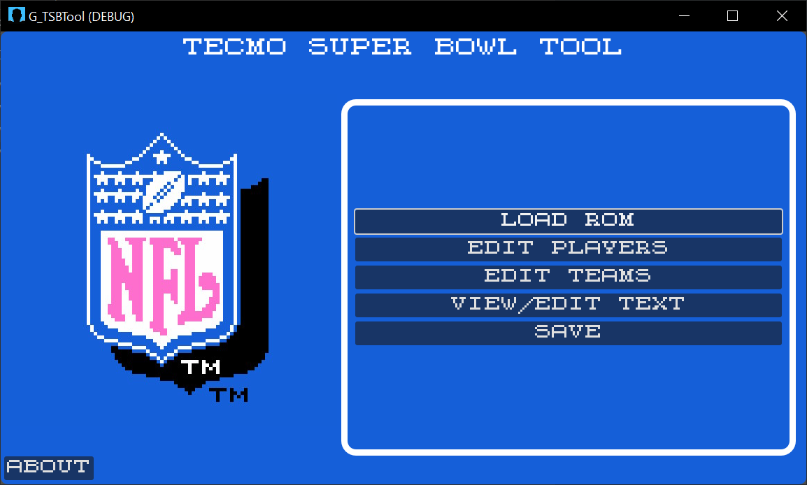
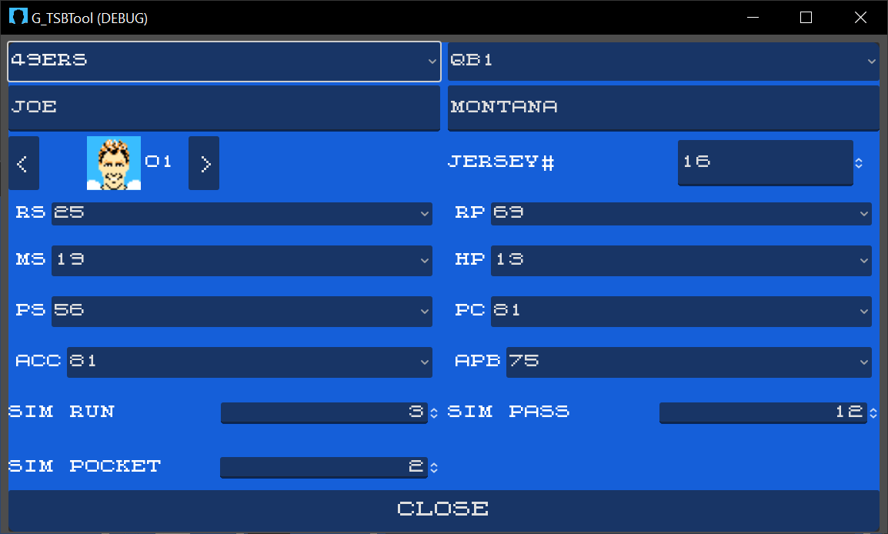
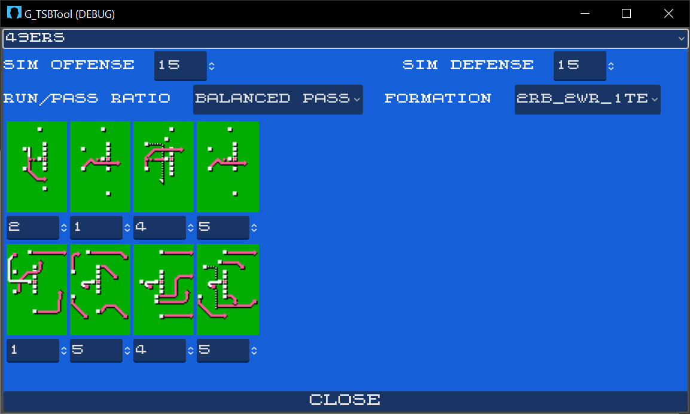
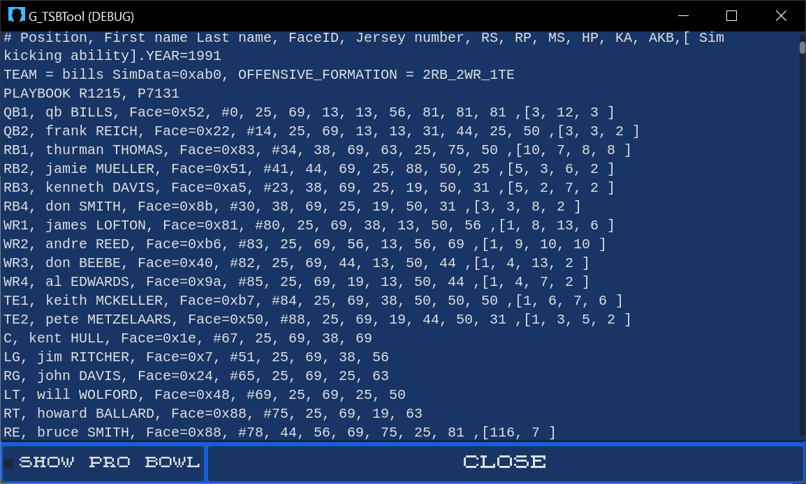

# TSBTool_Godot_4
This project is/was an expierement to see if I could get TSBTool running in the Browser (using the ability of Godot's HTML5 target);
enabling TSBTool to be used on Phones, Tablets and Broswers (the desktop Winforms app currently works on Linux/Mac when run under mono).
This Godot Project would not replace TSBToolSupreme.exe, just augment it.

Godot has a rich set of controls for building UIs and it's a very nice Tool to build a cross-platform UI; 
although 'WinForms' still does enable a much more rapid development cycle.

In Godot's current form (4.3) the HTML5 target only works for non-C# projects; HTML5 targeting for Godot 4 is WIP.
At some point in the future I hope to update this project with a working HTML5 export.

## Supported Game versions
* TSB nes 
* TSB SNES
* TSBII SNES
* TSBIII SNES

## Building
Before you build this Godot Project you'll need to run the 'Create_links.bat' file inside the 'Lib.NET' folder.
This creates links to the core TSBTool source files that enables manipulation of TSB ROMS. 

(Tools = Visual Studio 2022 & Godot 4.3)

## Debugging (Windows app)
For Debugging the C# side, it's easiest to export to a Win64 exe and set that as your debug target.

## Current State
Functional but minimally tested.

## Screen Shots

### Main

### Edit Player

### Edit Team

### Edit Text

